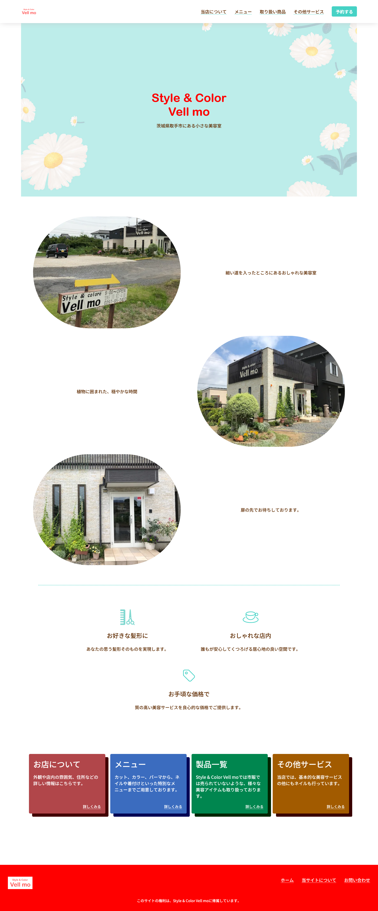
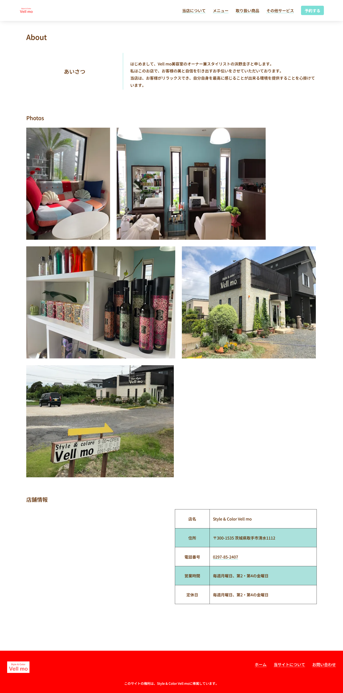
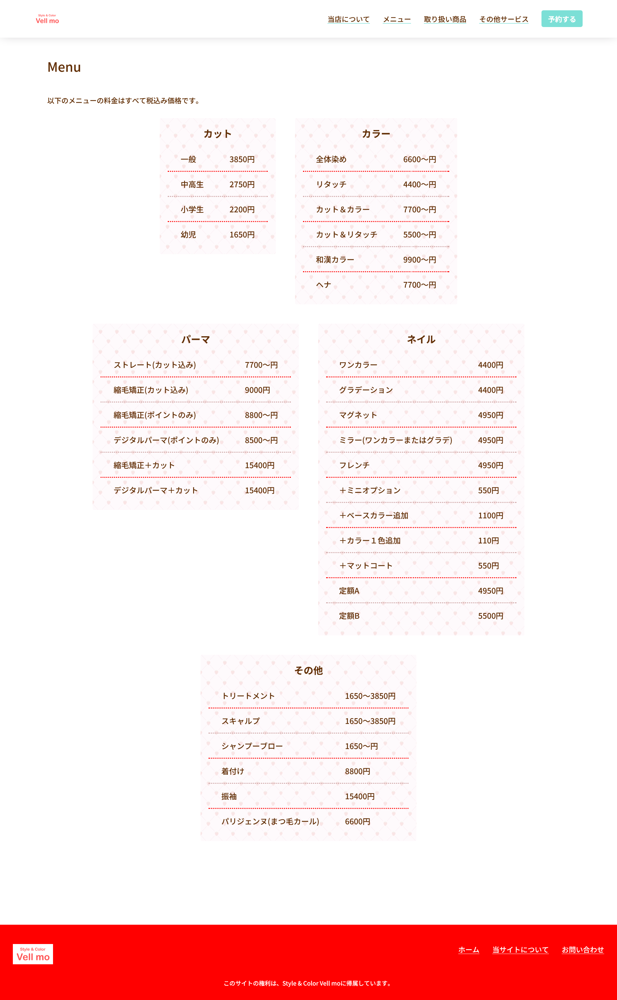
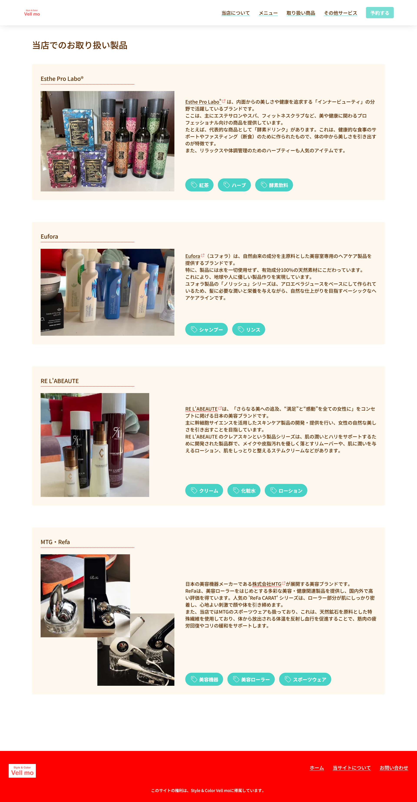
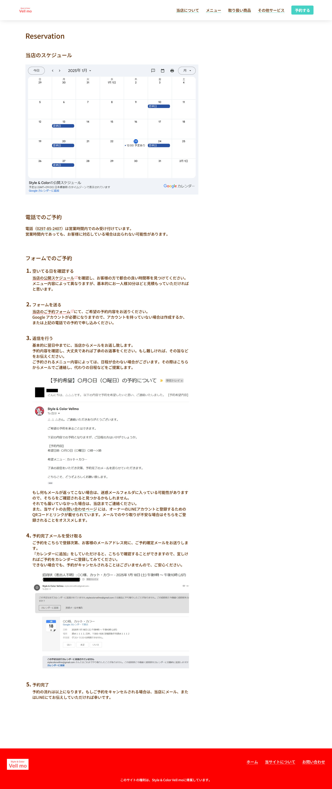
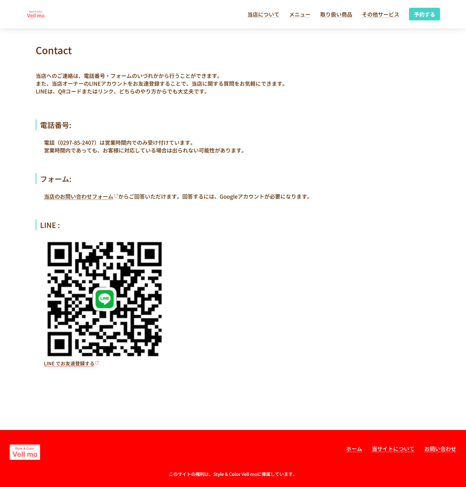
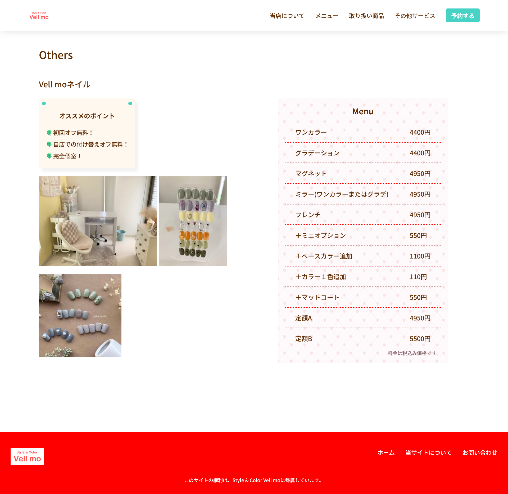
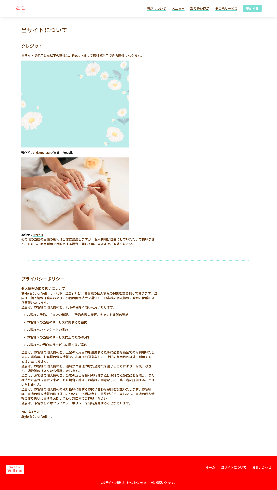
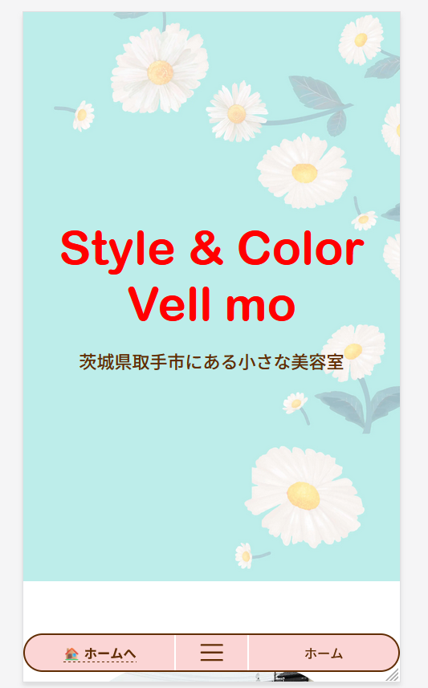
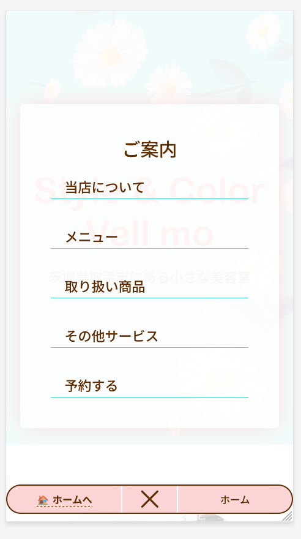

# 取手の美容室 Style & Color Vell mo の公式サイト

これは、取手市にある小さな美容室 Style & Color Vell mo の公式サイトです。

特に頼まれてやったわけではなく、長くお世話になっているということで勝手に作り、公式サイトとして扱ってもいいと言ってくれたため、実質、公式サイトになっています。

かなり前に、Reactでも作りましたが、その時の私は本当に初心者でみっともないコードばかり書いていたので、Svelteでゼロから書き直しました。

Re: ゼロから始めるVell moサイト作り！ってことで、私のこれまでの過ちを反省し、それをすべて活かしたものになります。

コンテンツをパクるのは著作権上ダメですが、コードはご自由にご利用ください。個人でも商用でも構いません！特にライセンス表示などもしなくてOKです。

## ページ

- **ホーム**

  当サイトの顔！とも言える、ページです。かわいらしい花柄を背景にした大きなヒーローセクションが目を惹きます。

  

- **当店について**

  ちょっとしたオーナーのご挨拶と、お店の外観や内装の画像、店舗の基本情報が載っています。

  

- **メニュー**

  Style & Color Vell mo のメニューになります。メニュー表の背景の柄が可愛いですよね。

  

- **取り扱い製品一覧**

  Style & Color Vell mo で取り扱っている製品の一覧になります。私は美容にあまり詳しくありませんが、多分、有名どころの商品を扱っており、市販にはあまり流通していないものもあります。

  

- **ご予約案内**

  Style & Color Vell mo のご予約案内のページになります。このプロジェクトは、長文のコンテンツはマークダウンで記述しており、管理しやすいです。

  

- **お問い合わせページ**

  広々とした余白と、シンプルなデザインです。

  

- **その他サービスのページ**

  その他ページには、Vell mo ネイルについての詳細が記されています。今後追加されるかもしれないちょっとしたサービスの詳細もここに入れる予定です。

  

- **当サイトにて使用した素材へのリンクやプライバシーポリシー**

  当サイトで扱った画像で著作権表示が必要なものがあったのでそれと、プライバシーポリシーに関しての詳細が書いてあります。

  

## 工夫しているところ

- **レスポンシブに対応している**

  ほとんどデバイス幅で最適に見えるよう、レスポンシブに調整しています。

  特にグローバルに利用するメニューは使いやすいうえに、ページ名も表示してくれるため非常に便利で使い勝手がいいです。

  左の、『ホーム』を押すとホームへ戻り、真ん中のハンバーガーアイコンをクリックすると、メニューがアニメーションとともに表示され、右には現在のページ名が書かれています。

  

  

## 使用しているフレームワーク

SvelteKit

## 補足

このサイトでは、私が開発した、型安全にパスを生成するための**link-generator**というモジュールを使っています。

---

## 主要なコマンド

### 依存関係のインストール

```bash
npm i
```

### 開発サーバーを起動する

```bash
npm run dev
```

### アプリをビルドする

```bash
npm run build
```
